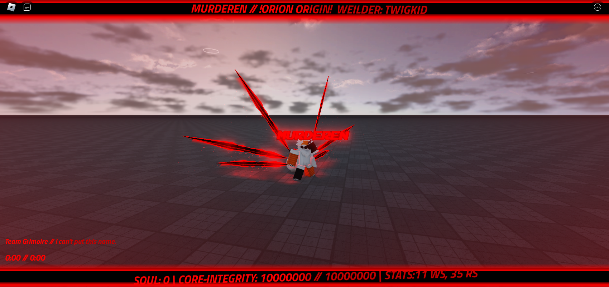
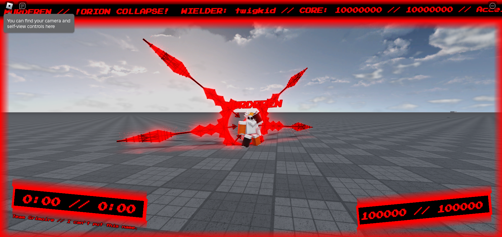

# *ORION // ORIGIN*
The first Orion in the series.
Orion // Origin (AKA Orion Collapse) was a project by twigkid @AlgodooUser123, two other people have worked on it during its development.
It was made after the now discontinued Cosmos Glitcher series from 2022 - 2023
It had two attacks: A Explosion-like attack binded to left click & Homing missile attack binded to "Z"

Made between
2023 - 2024
by: twigkid, maximilito and chip.

Song pack link: https://drive.google.com/file/d/1Dv4vN9bBsk980GqNsQ_I4IID0PFv9YXq/view?usp=sharing

# 1154 (Release Version, March 29th 2024)
Includes: main source, input source and .rbxm of the script.

# 830 (Pre UI & Wing Rework, 24th Feburary 2024)
Includes: main source, input source and .rbxm of the script.
It has: Old wings, Old ui

Orion Origin was taken down for "Misusing Roblox Systems" on 18/10/2024 at 18:04 (UK Time)
It has not been reinstated as of writing this.
